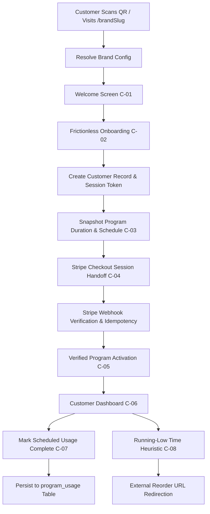

# Kabatos Program Platform — System Architecture

## Architectural Principles
1. **Multi-Brand Multi-Tenancy:** Single codebase and schema serving multiple brands (`/comprex`, `/demo-wellness`) resolved via database tenant configuration rather than hardcoded code branches.
2. **Snapshot Invariance:** When a customer activates a program, their duration and usage schedule are permanently snapshotted (`duration_snapshot`, `schedule_snapshot`). Subsequent brand configuration edits apply strictly to new program starts, preserving ongoing customer program integrity.
3. **Frictionless Customer Model:** Passwordless, session-based customer access utilizing cryptographically secure SHA-256 hashed session tokens stored in HttpOnly cookies (`kabatos_customer_session`).
4. **Isolated Master Admin:** Single Master Admin role enforced via Supabase Auth and capability-verified RPCs, isolated from customer routes.
5. **Deterministic Calendar-Date Domain:** All date calculations rely on deterministic calendar day math (UTC date parts), avoiding timezone offset anomalies and millisecond drift.

## Technology Stack
- **Framework:** Next.js 16 (App Router, Turbopack, React 19)
- **Language:** TypeScript 5.7 (Strict Mode)
- **Styling:** Tailwind CSS v4, PostCSS, Vanilla CSS Tokens
- **Database:** Supabase PostgreSQL with Row Level Security (RLS)
- **Authentication:** Supabase Auth (Admin) + Cryptographic Hashed Sessions (Customer)
- **Asset Storage:** Supabase Storage (`brand-assets` bucket)
- **Billing:** Stripe Subscriptions (Test Mode with idempotent webhook processing)
- **Deployment:** Vercel Staging & Production
- **Testing:** Vitest 5 (Unit & Engine), Playwright 1.63 (End-to-End on Chromium)

## Data Flow Diagram

