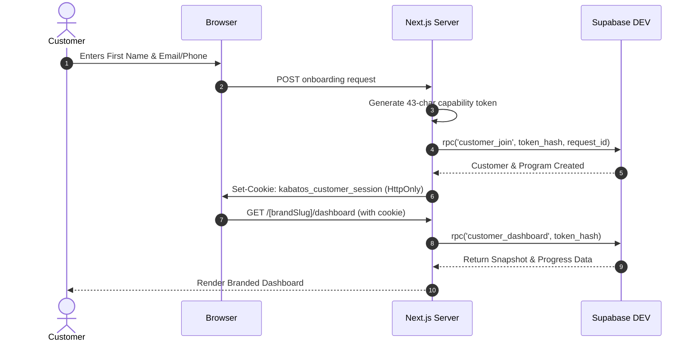

# Customer Sessions Service Specification

## Implementation Details (`lib/auth/customer-session.ts`)
The customer session lifecycle operates as follows:

## Security Guarantees
1. **Cookie Flagging:** `HttpOnly`, `SameSite=Lax`, `Path=/`, `Secure` (production).
2. **No LocalStorage Auth:** Zero client-side script access to authentication tokens prevents XSS token theft.
3. **Idempotent Onboarding:** Protected by `onboarding_request_id` preventing accidental duplicate customer creation upon double-click.
